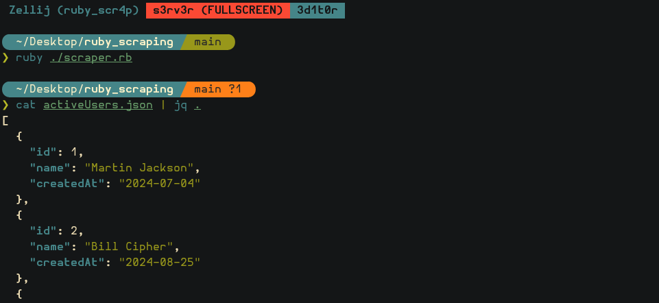

# Ruby Scraper



A **Ruby** script that fetches data from the **MySQL server** and filters the active users.

## Running project

Install dependencies:

```sh
bundle install
```

Run mysql server with docker:

```sh
docker-compose up -d
```

Run script:

```sh
ruby ./scraper.rb
```

## Stack

- [Active Record](https://guides.rubyonrails.org/active_record_basics.html)
